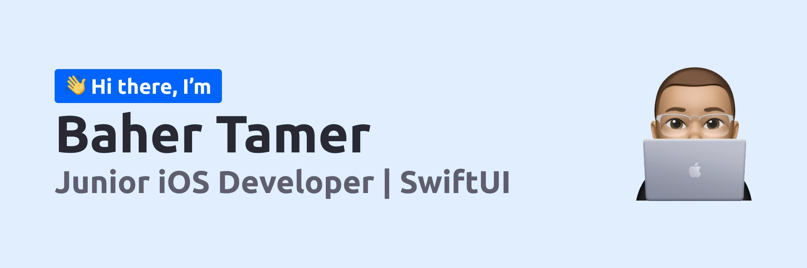

<!-- Image -->

<!-- Title Section -->
<h2 align = "center">
    <b>A passionate iOS Developer from Egypt 🇪🇬</b>
</h2> 

 

<!-- Qutoe Section -->
> Challenges taught me how to be self-dependent and gain new skills, that's why I'm always willing to face new ones.

 

<!-- Bio Section -->
## __🪴 Bio__

Hello, world! My name is Baher. I live in cairo, Egypt. Currently I'm studying at faculty of computers and artificial intelligence under major of computer science and minor of information system.

 

<!-- Skills Section -->
## __🤹 Skills__

UX/UI Design | Git | Swift | SwiftUI

 

<!-- Programs Section -->
## __💻 Programs__

XCode | Adobe XD | Figma

 

<!-- Contact Section -->
## __💬 Contact__

* [Mail](mailto:baher.appledev@icloud.com)
* [LinkedIn](https://www.linkedin.com/in/bahertamer)
